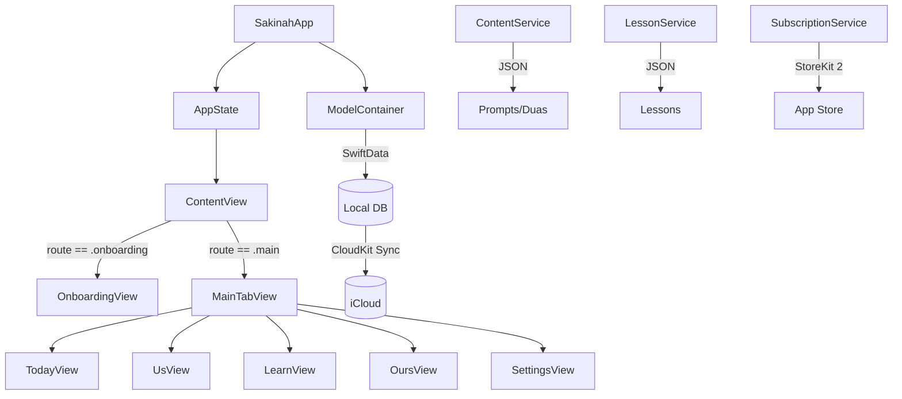

# Sakinah — Couples Wellness for Muslim Families

<p align="center">
  <strong>A premium iOS app helping Muslim couples grow in love, faith, and tranquility together.</strong>
</p>

<p align="center">
  iOS 17+ · Swift 6 · SwiftUI · SwiftData · CloudKit · StoreKit 2 · WidgetKit · Zero Dependencies
</p>

---

## Overview

Sakinah (سكينة — "tranquility") is a couples wellness app designed exclusively for Muslim couples. It combines daily relationship prompts, shared du'as, mood tracking, a visual wellness garden, weekly reflections, a private encrypted space, and structured Islamic relationship education — all wrapped in a premium, native iOS experience.

**Core Philosophy:** Everything is on-device first. No accounts, no sign-in walls. Data syncs between paired devices via CloudKit, but the app works fully offline.

---

## Features

### 🌅 Today Tab
- **Daily Prompt Card** — A 4-state interactive card (unanswered → waiting → both ready → revealed) with typewriter text animation, speech bubbles, particle burst reveal, and emoji reactions
- **Du'a of the Day** — Arabic (RTL) + transliteration + translation with audio playback and Islamic geometric border
- **Quick Check-In** — 5-mood selector with optional notes, partner visibility, one-per-day persistence

### 🌿 Us Tab
- **Wellness Garden** — Canvas-rendered garden with 5 plants representing relationship dimensions (Communication, Quality Time, Spiritual Connection, Emotional Safety, Growth), each at 5 growth levels with ambient sway and breeze animations
- **Weekly Reflection** — Paged 5-question flow (one per dimension) with 5-point scale, privacy toggle, and garden growth update
- **Milestones & Memories** — Auto-generated milestones (7d, 30d, 100d, etc.) + user-created memories with photo picker

### 📖 Learn Tab
- **Weekly Lessons** — Structured articles with parallax illustrations, hadith sections, pull quotes, and "Try This Together" actions
- **Conversation Starter Packs** — 5 themed packs (100 prompts total): Before Baby, Money & Us, Our Dreams, Difficult Conversations, Intimacy & Closeness

### 🔒 Ours Tab (Private Encrypted Space)
- **Shared Journal** — Reverse-chronological entries with privacy toggle and partner-tinted cards
- **Love Letters** — Write now, deliver later with lined-paper editor and scheduled notifications
- **Shared Goals** — Progress tracking with animated bars and completion celebrations
- **Wishlists** — Side-by-side columns (yours vs partner's) with inline add and swipe-to-delete

### ⚙️ Settings
- Profile management, notification preferences, subscription management, du'a language, Hijri calendar, appearance, data export/deletion

### 💎 Premium (StoreKit 2)
- Monthly ($9.99), Annual ($49.99), Lifetime ($129.99)
- Soft paywall — core features always free
- Premium unlocks: conversation packs, trend insights, love letters, shared goals

### 📱 Home Screen Widget (WidgetKit)
- **Small**: Daily prompt with category badge
- **Medium**: Daily prompt + du'a of the day (Arabic + translation)

---

## Architecture

```
ios/
├── Sakinah/
│   ├── App/
│   │   └── AppState.swift              # Global app state (@Observable)
│   ├── ContentView.swift               # Root routing (onboarding ↔ main)
│   ├── SakinahApp.swift                # App entry, SwiftData schema, StoreKit init
│   │
│   ├── DesignSystem/
│   │   ├── SakinahColor.swift          # Color tokens (light/dark)
│   │   ├── SakinahFont.swift           # Typography scale
│   │   ├── SakinahSpacing.swift        # Spacing, radius, shadow, animation tokens
│   │   ├── Theme.swift                 # Global constants
│   │   ├── Components/
│   │   │   ├── SakinahBadge.swift      # Category pill badges
│   │   │   ├── SakinahButton.swift     # Primary/secondary/ghost buttons
│   │   │   ├── SakinahCard.swift       # Elevated card container
│   │   │   ├── SakinahEmptyState.swift # Empty state with icon + CTA
│   │   │   ├── SakinahLoadingView.swift
│   │   │   ├── SakinahTextField.swift
│   │   │   └── OfflineBanner.swift     # NWPathMonitor connectivity banner
│   │   └── Modifiers/
│   │       ├── GlowModifier.swift      # Layered glow shadow
│   │       ├── PressModifier.swift     # Press-scale interaction
│   │       ├── ShimmerModifier.swift   # Shimmer loading effect
│   │       └── AccessibilityModifiers.swift  # Reduce motion, keyboard dismiss
│   │
│   ├── Models/
│   │   ├── User.swift                  # User profile + preferences
│   │   ├── Couple.swift                # Couple with garden state (JSON-encoded)
│   │   ├── Enums.swift                 # GardenDimension, GardenState, Mood, PromptCategory, etc.
│   │   ├── CheckIn.swift              # Daily mood check-in
│   │   ├── DailyPrompt.swift          # Prompt metadata
│   │   ├── PromptResponse.swift       # User's prompt response
│   │   ├── WeeklyReflection.swift     # 5-dimension reflection scores
│   │   ├── Memory.swift               # Photo memory
│   │   └── OursModels.swift           # JournalEntry, LoveLetter, SharedGoal, WishItem, Lesson
│   │
│   ├── Services/
│   │   ├── ContentService.swift       # JSON content loading, deterministic daily selection
│   │   ├── LessonService.swift        # Lesson loading + conversation packs (100 prompts)
│   │   ├── SubscriptionService.swift  # StoreKit 2 full implementation
│   │   ├── EncryptionService.swift    # CryptoKit AES-GCM E2E encryption
│   │   ├── CloudKitService.swift      # CloudKit sync (stub)
│   │   ├── PairingService.swift       # Invite code generation/validation
│   │   └── NotificationService.swift  # Local notification scheduling
│   │
│   ├── Features/
│   │   ├── MainTabView.swift          # Custom tab bar with 4 tabs + settings
│   │   │
│   │   ├── Onboarding/               # Welcome → Invite → Setup → First Prompt
│   │   │
│   │   ├── Today/
│   │   │   ├── TodayView.swift        # Main scroll with header + 3 cards
│   │   │   ├── TodayViewModel.swift   # 4-state prompt machine, check-in logic
│   │   │   ├── DailyPromptCard.swift  # Hero card with typewriter, speech bubbles, reactions
│   │   │   ├── DailyDuaCard.swift     # Arabic RTL, geometric border, audio
│   │   │   ├── QuickCheckInCard.swift # 5 moods, notes, partner visibility
│   │   │   ├── SpeechBubble.swift     # Reusable bubble shape
│   │   │   └── ParticleSystem.swift   # Canvas particle burst
│   │   │
│   │   ├── Us/
│   │   │   ├── UsView.swift           # Garden + reflection + milestones
│   │   │   ├── UsViewModel.swift      # Garden state, milestones, trends
│   │   │   ├── WellnessGardenView.swift    # Canvas + TimelineView garden
│   │   │   ├── GardenPlantRenderer.swift   # 5 plant types × 5 levels
│   │   │   ├── PlantDetailSheet.swift      # Plant info + 4-week trends
│   │   │   ├── WeeklyReflectionCard.swift  # Paged 5-question flow
│   │   │   └── MilestonesView.swift        # Horizontal scroll + add memory
│   │   │
│   │   ├── Learn/
│   │   │   ├── LearnView.swift        # Weekly lesson + conversation packs
│   │   │   └── LessonDetailView.swift # Parallax detail + pack sheet
│   │   │
│   │   ├── Ours/
│   │   │   ├── OursView.swift         # 2×2 encrypted feature grid
│   │   │   ├── SharedJournalView.swift
│   │   │   ├── LoveLettersView.swift
│   │   │   ├── SharedGoalsView.swift
│   │   │   └── WishlistsView.swift
│   │   │
│   │   └── Settings/
│   │       ├── SettingsView.swift      # 6-section settings
│   │       └── SakinahPaywallView.swift # 3-tier paywall
│   │
│   ├── Resources/
│   │   ├── Prompts.json               # 32 daily prompts
│   │   ├── Duas.json                  # 21 du'as with Arabic + sources
│   │   └── Lessons.json               # 5 structured lessons
│   │
│   └── Utilities/
│       ├── Constants.swift
│       ├── DateFormatting.swift        # Gregorian, Hijri, relative
│       └── HapticEngine.swift         # Tap, select, success, celebration, error
│
└── SakinahWidget/
    └── SakinahWidget.swift            # Small + Medium home screen widgets
```

---

## Data Flow



---

## Design System

### Colors
| Token | Light | Dark | Usage |
|-------|-------|------|-------|
| `primary` | `#0D5C63` | `#14919B` | Primary actions, links |
| `accent` | `#C4923A` | `#D4A84B` | Highlights, gold accents |
| `background` | `#FDF6EC` | `#0A0A1A` | Page background |
| `surface` | `#FFFFFF` | `#1A1A2E` | Cards, elevated surfaces |
| `textPrimary` | `#1A1A2E` | `#F2F0ED` | Headings, body |
| `textSecondary` | `#6B7280` | `#9CA3AF` | Subtitles, captions |

### Typography
| Token | Size | Weight | Usage |
|-------|------|--------|-------|
| `heroTitle` | 34 | Bold | Splash screens |
| `title1` | 28 | Bold | Tab headers |
| `title2` | 22 | Semibold | Card titles |
| `headline` | 17 | Semibold | Section headers |
| `body` | 17 | Regular | Body text |
| `arabic` | 24 | Regular (serif) | Quranic text |
| `caption` | 13 | Regular | Metadata |

### Animations
| Token | Type | Usage |
|-------|------|-------|
| `spring` | 0.45 response, 0.8 damping | Standard interactions |
| `gentle` | 0.6 response, 0.85 damping | Page transitions |
| `bounce` | 0.35 response, 0.6 damping | Selection feedback |
| `slow` | 0.8s ease-in-out | Ambient effects |

---

## Content Architecture

### Daily Content Selection
Content is selected **deterministically** using a hash of `coupleID + dayOfYear`, ensuring both partners always see the same prompt/du'a without network communication.

### Garden Growth Algorithm
| Input | Effect |
|-------|--------|
| Weekly reflection scores | 40% weighted blend toward target level |
| Daily prompt/check-in | +0.05 to Communication & Emotional Safety |
| Inactivity | -0.5 levels per inactive week |
| Floor/ceiling | Min 1.0, Max 5.0 |

### Prompt State Machine
```
Unanswered → [user submits] → Waiting → [partner submits] → Both Ready → [user taps reveal] → Revealed
```

---

## SwiftData Schema

```
User ─┬─ Couple ─┬─ CheckIn
      │          ├─ PromptResponse
      │          ├─ WeeklyReflection
      │          ├─ Memory
      │          ├─ JournalEntry
      │          ├─ LoveLetter
      │          ├─ SharedGoal
      │          └─ WishItem
      └─ Lesson (completion tracking)
```

**12 models** registered in the shared `ModelContainer`.

---

## Security

- **E2E Encryption**: All Ours tab content encrypted with CryptoKit AES-256-GCM before CloudKit write
- **On-Device First**: Core features work fully offline via SwiftData
- **No Third-Party Dependencies**: Zero external packages — only Apple frameworks
- **Data Deletion**: Full cascade delete with 2-step confirmation (type "DELETE" + final alert)

---

## Premium Tiers

| Plan | Price | Trial |
|------|-------|-------|
| Monthly | $9.99/mo | — |
| Annual | $49.99/yr | 7-day free trial |
| Lifetime | $129.99 | — |

**Free features**: Daily prompts, du'as, check-ins, wellness garden, weekly reflections, journal, lessons
**Premium features**: Conversation packs, trend insights, love letters, shared goals, wishlists

---

## Widget

| Family | Content | Deep Link |
|--------|---------|-----------|
| Small | Daily prompt (3 lines) + category badge | `sakinah://today/prompt` |
| Medium | Prompt (left) + Arabic du'a + translation (right) | `sakinah://today/prompt` |

Timeline refreshes at midnight daily with `.atEnd` reload policy.

---

## Building

### Requirements
- Xcode 15.0+
- iOS 17.0+
- Swift 6

### Setup
1. Clone the repository
2. Open `ios/Sakinah.xcodeproj` in Xcode
3. Add `Prompts.json`, `Duas.json`, and `Lessons.json` to the app target's "Copy Bundle Resources" build phase
4. For WidgetKit: add the `SakinahWidget` target and configure the App Group
5. For StoreKit: configure product IDs in App Store Connect or use a StoreKit configuration file for testing
6. Build and run on a simulator or device

### StoreKit Testing
Create a `Sakinah.storekit` configuration file with:
- `com.sakinah.premium.monthly` (Auto-Renewable, $9.99)
- `com.sakinah.premium.annual` (Auto-Renewable, $49.99)
- `com.sakinah.premium.lifetime` (Non-Consumable, $129.99)

### CloudKit Testing
Configure a CloudKit container in the Apple Developer portal and add the entitlement to the app target.

---

## Project Stats

| Metric | Count |
|--------|-------|
| Swift files | 74 |
| JSON content files | 4 |
| SwiftData models | 12 |
| Daily prompts | 32 |
| Du'as with sources | 21 |
| Structured lessons | 5 |
| Conversation prompts | 100 |
| Design tokens | ~40 |
| Third-party deps | **0** |

---

## License

Private — All rights reserved.
